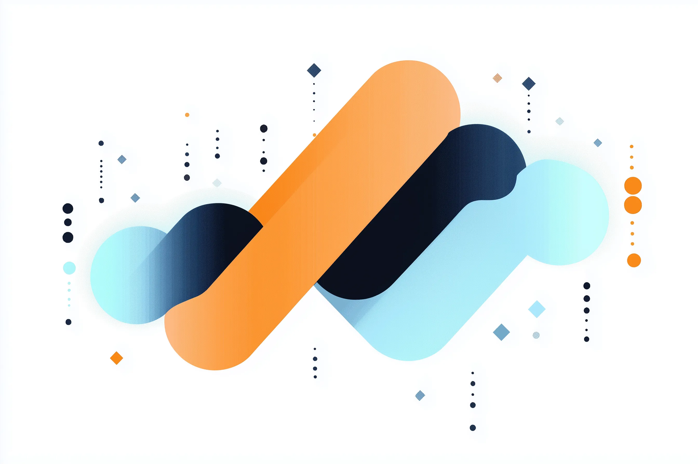
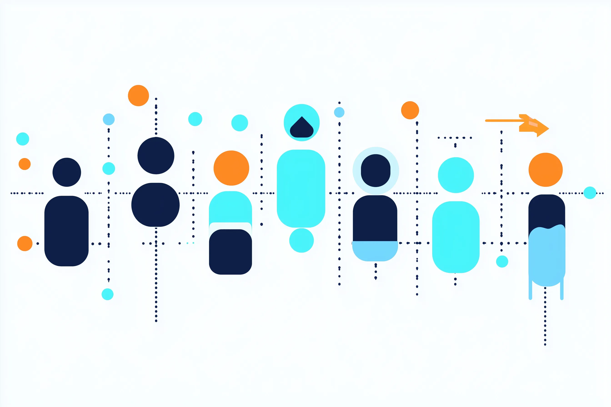
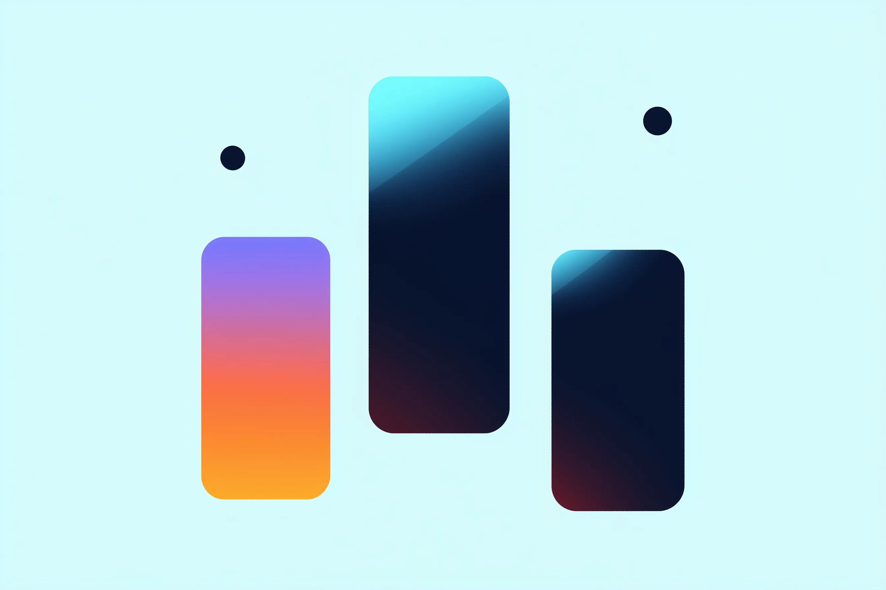
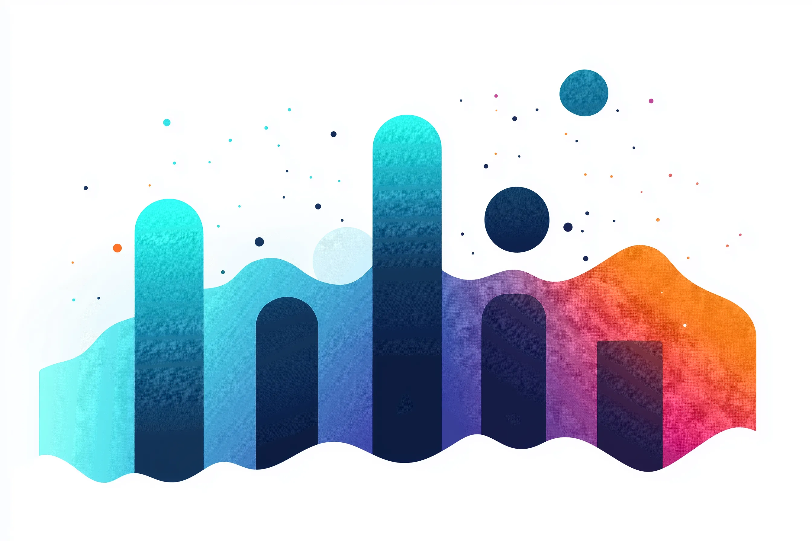

<section class="hero" markdown>

Futarchy Labs

# Markets for better decisions

Futarchy Labs builds market infrastructure for autonomous decision-making. We
turn questions about proposals, agents, and objectives into tradable signals
that can guide incentives, funding, and on-chain execution.

Today this includes live futarchy markets for governance decisions. The broader
direction is market-native coordination for autonomous organizations and AI
agent teams.

[Start with the concept](how-futarchy-works.md){ .md-button .md-button--primary }
[Explore the vision](vision/README.md){ .md-button }

</section>

## What we are building

### Decision markets

Conditional markets compare the value of different worlds before a decision is
made. They are useful when committees, votes, and expert forecasts do not
aggregate enough information.

[How futarchy works](how-futarchy-works.md)

### Agent markets

Agent teams can use markets to price tasks, forecast reviews, allocate work,
measure contribution, and evolve their own operating rules from evidence.

[Agent markets](vision/agent-markets.md)

### Autonomous optimizers

FAO and related systems explore how market signals can become executable:
treasury control, liquidity routing, token-backed incentives, and gradual
autonomy.

[FAO overview](vision/fao.md)

Public-good and grant programs can also use markets to estimate which proposals
create the most marginal impact for a chosen objective. See
[Objectives and Impact Markets](vision/objectives-and-impact.md).

## Core ideas

**Vote on values**

Humans or communities choose what should be optimized.

**Bet on beliefs**

Markets aggregate beliefs about which actions improve the chosen objective.

**Separate evaluation**

The system being improved should not control the measurement layer that judges it.

**Start advisory**

Signals can inform decisions first, then become more binding as trust grows.

## Read by role

- **Technically curious readers:** [How Futarchy Works](how-futarchy-works.md)
  and [Vision](vision/README.md).
- **Agent builders:** [Agent Markets](vision/agent-markets.md) and
  [Bayes Market](vision/bayes-market.md).
- **Protocol researchers and integrators:** [Protocol Overview](protocol/README.md)
  and [Proposal Lifecycle](protocol/proposal-lifecycle.md).
- **DAO operators:** [DAO Operator Guide](dao/README.md) and
  [Integration Guide](dao/integration.md).
- **Traders:** [Trading in Futarchy Markets](trading-in-futarchy.md).
- **Sponsors and external contributors:** [Sponsored Proposals](dao/sponsorship.md)
  and [Objectives and Impact Markets](vision/objectives-and-impact.md).

## Current public systems

- [futarchy.fi](https://futarchy.fi/) - live interface for conditional governance
  markets.
- [bayes.futarchy.ai](https://bayes.futarchy.ai/) - experimental Bayesian
  prediction-market engine.
- [GitHub organization](https://github.com/futarchy-fi) - public code and issue
  tracker.

See [Live Systems and Repos](deployments-and-addresses.md) for a public-safe
inventory.
