# DAO Operator Guide: How Token Futarchy Works

This page explains how DAOs use **token futarchy** to evaluate governance decisions using market signals.

Futarchy does not replace governance by default. Instead, it provides **pre-decision, incentive-aligned signals** about the *expected value* of approving or rejecting a proposal. These signals are designed to inform — and over time, improve — governance decisions.

This guide focuses on **how futarchy works conceptually**, how to interpret its outputs, and the **recommended default model** for DAOs.  
Operational details (liquidity, oracles, thresholds, timelines) are covered in the Integration Guide.

---

## Motivation

Governance decisions are hard.

Proposals often involve complex tradeoffs and uncertainty, and it is difficult to know in advance which actions will actually improve outcomes. Voting aggregates **preferences**, but it does not aggregate **beliefs about consequences** very well.

In 2024, MakerDAO rebranded to “Sky.” Within ten days, the token lost roughly **20% of its market value** — over **$500M**.  
Many believed the rebrand caused this collapse, but without a way to isolate its effect, it was impossible to know for sure.

**Futarchy addresses this problem.**

By running *two parallel markets* — one where a decision happens, and one where it does not — a DAO can observe the **expected token price impact of a proposal before committing to it**.

Instead of guessing after the fact, futarchy makes expectations visible *in advance*.

---

## Prediction Markets vs. Futarchy Markets

It is important to distinguish **prediction markets** from **futarchy markets**:

- **Prediction market:**  
  *“What is the probability that event X will happen?”*

- **Futarchy market:**  
  *“What will the token be worth if we do X versus if we don’t?”*

Prediction markets estimate probabilities.  
Futarchy markets compare **counterfactual worlds** and measure the **expected value impact of a decision**.

The goal is not to predict outcomes, but to inform choices.

---

## Futarchy Evaluation (Default Model)

When a proposal is evaluated using futarchy, two conditional markets are created:

- **YES market** — trades the token price *if the proposal is approved*
- **NO market** — trades the token price *if the proposal is rejected*

Participants trade in these markets using real capital, expressing their beliefs about how the proposal would affect long-term value.

During the evaluation window (default: **7 days**), prices evolve continuously.  
At the end of the window, the DAO compares the **time-weighted average prices (TWAP)** of the two markets.

### Default Recommendation Rule

By default, Futarchy.FI recommends:

- **Approve** if `YES > NO + threshold`
- **Reject** otherwise

- **Default threshold:** **1%**
- **Scope:** global per DAO (can be raised for high-impact proposals)

This rule is a **recommended default**, not a protocol requirement.  
DAOs are encouraged to tune thresholds conservatively for sensitive decisions.

---

### Trader Perspective (Illustration)

Even if this guide is for DAOs, seeing how traders act makes it clear:

- **Supporter’s trade:** *“I only want to invest if this proposal passes.”*  
  → They buy into the YES Market.

```mermaid
%%{init: {'theme':'base','themeVariables':{'fontSize':'12px','primaryColor':'#eef6ff','primaryBorderColor':'#7aa2ff','lineColor':'#7aa2ff'}}}%%
flowchart LR
  A["Buy in YES market (conditional)"] --> B{"Proposal approved?"}
  B -- Yes --> C["Redeem → tokens (investment executed)"]
  B -- No  --> D["Refund → funds returned"]
  classDef box fill:#f9f9ff,stroke:#7aa2ff,rx:6,ry:6;
  class A,B,C,D box;
```

- **Opponent’s trade:** *“I want to sell my tokens if this proposal passes.”*  
  → They sell into the YES Market (conditional exit).  

```mermaid
%%{init: {'theme':'base','themeVariables':{'fontSize':'12px','primaryColor':'#eef6ff','primaryBorderColor':'#7aa2ff','lineColor':'#7aa2ff'}}}%%
flowchart LR
  A["Sell in YES market (conditional)"] --> B{"Proposal approved?"}
  B -- Yes --> C["Settle → stable (exit completed)"]
  B -- No  --> D["Revert → keep tokens"]
  classDef box fill:#f9f9ff,stroke:#7aa2ff,rx:6,ry:6;
  class A,B,C,D box;
```

These individual bets aggregate into a market price signal — the information the DAO cares about.

## Interpreting the Signal

- **YES meaningfully above NO**  
  → The market expects the proposal to *increase long-term value*.

- **NO above YES**  
  → The market expects the proposal to be *value-destructive*.

- **YES and NO very close**  
  → The market is signaling **no measurable expected impact**.

### Important: No Activity Is Still Information

> **Thin or inactive markets are not a failure mode.**

If prices remain close to the spot price with little trading, the correct interpretation is:

> *“The proposal does not appear to materially affect value.”*

This is a valid and often useful signal, especially for low-impact or cosmetic changes.

---

## Why Futarchy Works

Futarchy works because it allows participants to express **beliefs conditionally**, rather than politically.

- Traders risk capital only in the world they care about.
- Informed participants profit by correcting mispricings.
- Uninformed or manipulative trades are costly to sustain.

Because positions are conditional, participants are incentivized to reveal **honest expectations** about value — not preferences, rhetoric, or social alignment.

The result is a market-based estimate of expected value.

---

## Noise, Manipulation, and Market Quality

Markets can always be influenced in the short term, but futarchy is designed so that:

- Manipulation without information is **expensive**
- Informed traders profit by trading against noise
- **TWAP averaging** reduces last-minute price swings

In practice, attempts at manipulation tend to transfer wealth from manipulators to informed traders, while improving price accuracy.

See the DAO FAQ for deeper discussion.

---

## How DAOs Use Futarchy Outputs

Futarchy.FI is **advisory by default**.

Common governance patterns include:

- **Advisory** — futarchy recommendations inform votes and deliberation
- **Veto-gated** — proposals must pass futarchy to advance
- **Autonomous (FAO)** — futarchy outcomes trigger execution automatically *(advanced; launching separately)*

Most DAOs begin with **advisory futarchy**, build trust in the signal, and expand from there.

---

## Scope and Limits

Futarchy:

- does **not** execute proposals on its own (by default)
- does **not** assess proposal intent, fairness, or political legitimacy
- does **not** guarantee good outcomes

Futarchy evaluates **expected value**, as reflected in market prices.  
How strongly this signal is weighted alongside other governance considerations is a decision for each DAO.

---

## Learn More

- **[Adoption Levels](./adoption-levels.md)** — advisory, sponsored, and autonomous paths
- **[Integration Guide](./integration.md)** — liquidity, oracles, thresholds, timelines  
- **[DAO FAQ](./faq.md)** — manipulation, noise, liquidity, oracle mechanics  
- **[Sponsored Proposals](./sponsorship.md)** — attracting capital and ideas via sponsored futarchy  

---

## Navigation

- ⬆️ **[Futarchy.FI Documentation](../README.md)**
- ➡️ **[Adoption Levels](./adoption-levels.md)**
- 🔁 **[Trader Guides](../traders/README.md)**
- 🔁 **[Activist Sponsors](../activists/README.md)**
