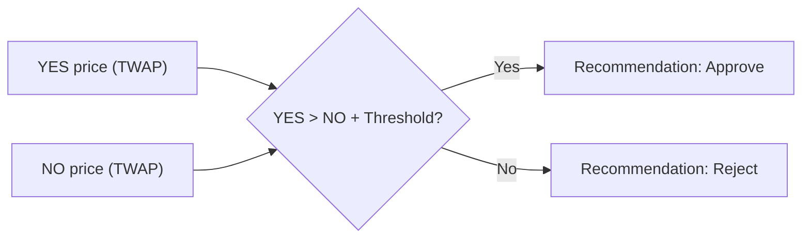
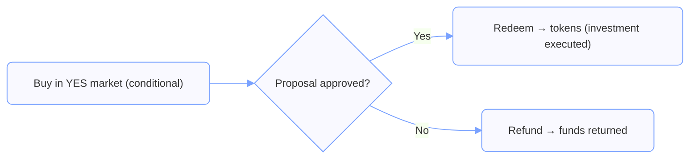
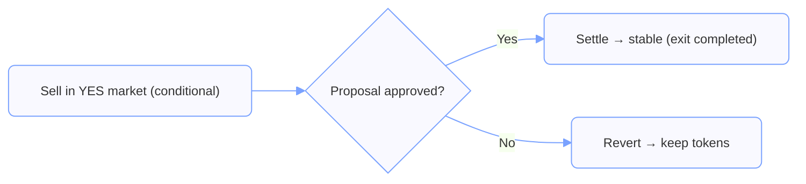

## How Token Futarchy Works

### Motivation

In 2024, MakerDAO rebranded to “Sky.” Within ten days, the token lost ~20% of its market value — over $500M.  
Many believed the rebrand caused this collapse, but without a way to isolate its effect it was impossible to know for sure.  

**Futarchy solves this.** By running *two parallel markets* — one where the rebrand happens, and one where it does not — the DAO could have seen the expected token price impact *before committing*.  

---

### Prediction vs Futarchy Markets

It helps to distinguish **prediction markets** from **futarchy markets**:

- **Prediction market:** “What’s the probability event X will happen?”  
- **Futarchy market:** “What will the token price be if we do X vs if we don’t?”  

Instead of betting on the chance of an outcome, futarchy isolates the *value impact of a decision*.

---

### Futarchy Evaluation

When a proposal is introduced, futarchy creates two conditional markets:

- **YES Market** — trades the token price *if the proposal passes*.  
- **NO Market** — trades the token price *if the proposal fails*.  

Traders buy and sell in these pools, revealing their beliefs about the impact.

After a decision window (default 7 days), the DAO compares the two average prices (TWAP).  
- If **YES > NO** by a threshold (default 1%), the proposal is recommended.
- Otherwise, it is rejected.

---

### Trader Perspective (Illustration)

Even if this guide is for DAOs, seeing how traders act makes it clear:

- **Supporter’s trade:** *“I only want to invest if this proposal passes.”*  
  → They buy into the YES Market.

- **Opponent’s trade:** *“I want to sell my tokens if this proposal passes.”*  
  → They sell into the YES Market (conditional exit).  

These individual bets aggregate into a market price signal — the information the DAO cares about.

---

### Filtering Out Noise

A common question: *“But token prices move for many reasons. How can we know it’s about the proposal?”*  

Futarchy answers this by comparing **two parallel markets** — *with* vs *without* the proposal.  
Because both markets are subject to the same external factors, the **difference between them isolates the causal impact of the decision itself**.

(See the FAQ for more details on manipulation and noise.)
